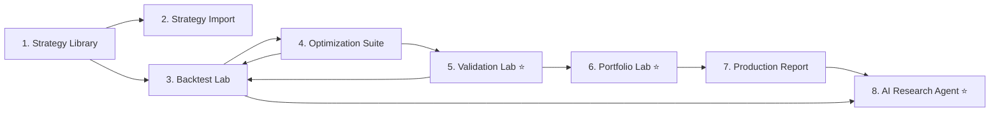

# Stratestic — Institutional-Grade Quant Research Platform

Transform from a basic backtesting dashboard into a **professional quant research platform** that answers not just *"Is this strategy profitable?"* but *"Will this strategy survive tomorrow?"*

## Full Workflow



---

## User Review Required

> [!IMPORTANT]
> **This is a ground-up rewrite of all 3 frontend files** (`index.html`, `index.css`, `index.js`). The Flask backend (`app.py`) requires only minor additions. All computation engines (backtester, optimizer, indicators, MQL5 converter) are preserved — only the UI shell changes.

> [!IMPORTANT]
> **Implementation Phases.** Due to the scope, this will be built in 3 phases. Each phase produces a working, shippable product. Phase 1 is the foundation. Phases 2–3 add the differentiating features. **Approve to begin Phase 1.**

---

## Implementation Phases

| Phase | Pages | Key Features |
|-------|-------|-------------|
| **Phase 1** | Library, Import, Backtest Lab | Multi-page SPA shell, hash router, strategy cards, backtest engine, full KPI panel |
| **Phase 2** | Optimization Suite, Validation Lab | Parameter heatmaps, Walk Forward, Monte Carlo, Regime Detection, Robustness Score |
| **Phase 3** | Portfolio Lab, Production Report, AI Research Agent | Portfolio construction, trade replay, automated strategy analysis |

---

# Phase 1: Core Platform

## Page 1: Strategy Library (`#library` — Home)

The landing page. A professional strategy catalog.

**Layout:** Full-width, no sidebar. Top nav bar persistent across all pages.

| Element | Description |
|---------|-------------|
| **Top navigation** | Logo, page links (Library · Import · Backtest · Optimize · Validate · Portfolio · Report), backend status badge |
| **Hero section** | "Select a strategy to begin research" with strategy count |
| **Strategy grid** | 3-column card grid. Each card: strategy name, icon, param count, description, category tag |
| **Card hover** | Glassmorphism lift + glow. Reveals "Backtest →" and "Optimize →" quick actions |
| **Empty state** | If no strategies: prompt to import one |
| **Search/filter bar** | Filter by category (Trend, Mean Reversion, Momentum, Custom) |

**Built-in strategies:** MA Crossover, MACD Trend, Bollinger Bands, Momentum, Converted MT5 EA.
**Custom strategies:** Appear after import, tagged with purple "Custom" badge.

---

## Page 2: Strategy Import (`#import`)

Dedicated strategy onboarding.

| Section | Description |
|---------|-------------|
| **Upload zone** | Large drag-and-drop area with file icon, accepts `.py` and `.mq5` |
| **MQL5 Converter** | Side-by-side editor panes: MQL5 source ↔ Generated Python |
| **Sample selector** | Dropdown to load demo EAs (SMA Crossover, RSI Reversion, MACD Trend) |
| **Conversion terminal** | Animated log output with timestamps |
| **Validation checklist** | 4-item SDK check: inheritance, `calculate_positions`, `get_signal`, `params` dict |
| **"Add to Library →"** | Registers strategy, navigates back to Library with success toast |

---

## Page 3: Backtest Lab (`#backtest/{strategyId}`)

The core research workspace.

**Two-column layout:**

### Left: Configuration Panel (scrollable, ~320px wide)
- **Strategy header** — Name + "Change Strategy" link back to Library
- **Data Settings** — Dataset selector, Timeframe, Max Bars
- **Engine Settings** — Backtester type, Capital, Costs, Leverage slider, Short model
- **Strategy Parameters** — Dynamic sliders generated from strategy `params`
- **"Run Backtest" button** — Primary CTA, full width

### Right: Results Panel (flexible width)
- **KPI row** — 4 glass cards: Strategy Return, B&H Return, Sharpe, Max Drawdown
- **Chart viewport** — Tabbed: Equity Curve / Drawdown / Margin Ratio (Chart.js)
- **Key Performance Ratios** — 3 grouped tables: Performance & Returns, Risk & Drawdown, Trade Execution
- **Progress indicators** — Win Rate bar, Market Exposure bar
- **Liquidation alert** — Conditional warning banner

### Bottom Navigation Bar
- "← Strategy Library"
- "Optimize Parameters →"
- "Validate Strategy →" (Phase 2)
- "View Trade Log →"

---

# Phase 2: Differentiators

## Page 4: Optimization Suite (`#optimize/{strategyId}`)

Enhanced with **Parameter Stability Heatmaps**.

### Left Column: Configuration
- Algorithm selector (Grid Search / Genetic Algorithm)
- Metric selector (Sharpe, Return, Calmar, Sortino, Win Rate, Min DD)
- GA params (population, generations, mutation, selection) — conditional visibility
- Parameter sweep ranges table
- "Run Optimizer" button

### Right Column: Results
- Progress bar + percentage
- Convergence chart (fitness over iterations)
- Best fitness display
- Terminal logs
- **"Apply & Backtest →"** button

### NEW: Parameter Stability Heatmap
- After grid search completes, render a **2D heatmap** (Chart.js matrix plugin or canvas-drawn)
- X-axis = Param 1 values, Y-axis = Param 2 values, Color = Sharpe/metric value
- **Green plateau** = robust strategy, **isolated green dot** = curve-fitted
- For strategies with >2 params: dropdown to select which 2 params to visualize
- Color scale: Red (negative) → Yellow (0) → Green (positive)

---

## Page 5: Validation Lab (`#validate/{strategyId}`) ⭐

The competitive advantage. Four sections answering: *"Will this strategy survive?"*

### Section 1: Walk Forward Analysis

Split historical data into Train/Validate/Test windows automatically.

**Implementation (client-side JS):**
- Default split: 60% Train, 20% Validate, 20% Test
- User-adjustable via sliders
- Run the existing `runBacktestEngine` on each segment independently
- Optimize on Train, validate with optimized params on Validate, final test on Test

**Display:**
- Timeline visualization showing data splits (colored bars)
- Comparison table:

| Metric | Train | Validation | Test |
|--------|-------|------------|------|
| Return | — | — | — |
| Sharpe | — | — | — |
| Max DD | — | — | — |
| Win Rate | — | — | — |

- **Overfitting alert:** If Train Sharpe > 2× Test Sharpe → red warning banner: "⚠ Potential overfitting detected"
- **Degradation chart:** Bar chart comparing metrics across windows

### Section 2: Monte Carlo Engine

Generate 1000+ alternative realities.

**Implementation (client-side JS):**
- Take the trade list from the last backtest
- For each simulation:
  - Randomly reshuffle trade order (bootstrap sampling)
  - Apply random slippage (±0.01% to ±0.1%)
  - Apply random spread variation (±5% to ±20%)
  - Recalculate equity curve from reshuffled trades
- Compute return distribution across all simulations

**Display:**
- **Distribution histogram** (Chart.js bar chart) of final returns across simulations
- **Fan chart** showing Best/Median/Worst equity curve paths (3 overlaid lines)
- Summary stats:

| Metric | Backtest | MC Median | MC 5th Percentile | MC 95th Percentile |
|--------|----------|-----------|--------------------|--------------------|
| Return | — | — | — | — |
| Max DD | — | — | — | — |
| Sharpe | — | — | — | — |

- **Confidence indicator:** "There is a X% probability this strategy will be profitable"

### Section 3: Regime Detection

Classify historical periods and analyze per-regime performance.

**Implementation (client-side JS):**
- **Trend detection:** 50-bar SMA slope. Positive slope > threshold = Bull, negative = Bear, else = Sideways
- **Volatility detection:** 20-bar ATR percentile. Top 25% = High Vol, Bottom 25% = Low Vol
- Assign each bar a regime label
- Run backtest segmented by regime, compute per-regime metrics

**Display:**
- **Regime timeline** — Colored background bands on a price chart showing Bull/Bear/Sideways/HighVol periods
- **Per-regime table:**

| Regime | Bars | Return | Sharpe | Max DD | Win Rate |
|--------|------|--------|--------|--------|----------|
| 🟢 Bull Trend | — | — | — | — | — |
| 🔴 Bear Trend | — | — | — | — | — |
| 🟡 Sideways | — | — | — | — | — |
| 🟠 High Volatility | — | — | — | — | — |

- **Insight text:** Auto-generated: "This strategy performs best in Bull Trends (+45%) and struggles in Sideways markets (-3%)"

### Section 4: Robustness Score

Proprietary composite score: 0–100.

**Formula (client-side JS):**
```
Score = weighted average of:
  - Sharpe Ratio (normalized 0-100)           weight: 15%
  - Sortino Ratio (normalized 0-100)          weight: 10%
  - Max Drawdown (inverted, normalized)       weight: 15%
  - Walk Forward Stability                    weight: 20%
    (Test Sharpe / Train Sharpe ratio)
  - Parameter Sensitivity                     weight: 20%
    (% of parameter space with positive Sharpe)
  - Monte Carlo Stability                     weight: 20%
    (MC 5th percentile return / Backtest return)
```

**Display:**
- Large **circular gauge** (canvas-drawn) with score 0-100
- Color: Red (0-30) → Orange (31-50) → Yellow (51-70) → Green (71-85) → Cyan (86-100)
- **Grade label:**
  - 0-30: "High Risk — Not Deployable"
  - 31-50: "Fragile — Needs Improvement"
  - 51-70: "Moderate — Proceed With Caution"
  - 71-85: "Robust — Near Production Ready"
  - 86-100: "Institutional Grade ✓"
- Breakdown bars showing each component's contribution

---

# Phase 3: Advanced Features

## Page 6: Portfolio Lab (`#portfolio`) ⭐

Combine multiple strategies into a single portfolio.

**Implementation (client-side JS):**
- User drags strategy cards from a sidebar list into a "portfolio basket"
- Each strategy must have been backtested first (equity curve cached)
- Combine equity curves with equal weighting or user-defined allocation %
- Calculate portfolio-level metrics and correlation matrix

**Display:**
- **Strategy selector** — Checkboxes or drag-and-drop cards
- **Allocation sliders** — Weight % per strategy (must sum to 100%)
- **Correlation matrix** — Heatmap table of pairwise Pearson correlations between strategy returns
- **Portfolio equity curve** — Combined equity vs individual strategy lines
- **Portfolio metrics:** Combined Sharpe, Combined DD, CAGR, Diversification Ratio

---

## Page 7: Production Report (`#report/{strategyId}`)

Final deployment readiness review.

**Layout:**
- **Strategy summary header** — Name, optimized params, robustness score badge, final equity
- **Production readiness checklist** — Green/red items: Sharpe > 1? DD < 20%? Walk-forward stable? MC profitable?
- **Trade Execution Ledger** — Full scrollable table with export CSV
- **Quick stats recap** — Total trades, win rate, profit factor, SQN, Sharpe, max DD
- **Trade Replay Engine** — Play/Pause/Speed controls. Animates equity curve candle-by-candle with trade markers

### Trade Replay (canvas animation):
- Playback controls: Play, Pause, Speed (1x, 5x, 10x, 50x)
- Equity curve draws progressively left-to-right
- Trade markers appear at entry/exit points with PnL annotation
- Current bar price shown in real-time

---

## Page 8: AI Research Agent (`#research/{strategyId}`) ⭐

Rule-based automated strategy analysis engine. No LLM required — pure algorithmic analysis.

**Implementation (client-side JS):**
- Analyze all available data: backtest results, validation lab results, regime analysis, Monte Carlo, optimization heatmap
- Generate structured text insights using rule-based logic

**Auto-generated sections:**

### Strengths (green items)
Rules: Sharpe > 1.5, Sortino > 2, Win Rate > 55%, Profit Factor > 1.5, low MC variance, etc.

### Weaknesses (red items)
Rules: High DD, low win rate, negative regime performance, high parameter sensitivity, etc.

### Recommendations (blue items)
Rules: If volatility-sensitive → suggest ATR filter. If trend-only → suggest regime filter. If overfitting → suggest fewer parameters. Etc.

### Overfitting Risk Assessment
Based on Walk Forward degradation ratio and parameter heatmap concentration.

### Deployment Readiness Score
Same as Robustness Score but with additional checks (sufficient trades, sufficient data length, etc.)

**Display:**
- Clean card layout with color-coded sections
- Each insight is a card with icon + explanation
- Exportable as PDF-style report (print-friendly CSS)

---

## Proposed File Changes

### Frontend

#### [MODIFY] [index.html](file:///c:/Users/MYCkey98/Desktop/Organized_Files/01_Python_Projects/stratestic/index.html)
Complete rewrite. New structure:
- Top navigation bar (8 page links + logo + status badge)
- 8 page sections inside `<main>`, controlled by hash router
- Upload modal overlay retained
- Each page has its own self-contained layout

#### [MODIFY] [index.css](file:///c:/Users/MYCkey98/Desktop/Organized_Files/01_Python_Projects/stratestic/index.css)
Complete rewrite. New additions:
- Top nav bar with active indicators and animated underline
- Strategy card grid with glassmorphism hover
- Full-width page layouts (no persistent sidebar)
- Heatmap canvas styles
- Gauge/circular score component
- Regime timeline colored bands
- Trade replay controls
- Portfolio allocation interface
- Monte Carlo distribution chart
- Research agent card layout
- Page transition animations
- Breadcrumb trail
- Responsive breakpoints

#### [MODIFY] [index.js](file:///c:/Users/MYCkey98/Desktop/Organized_Files/01_Python_Projects/stratestic/index.js)
Restructured into clear sections:

**Preserved as-is:**
- `apiCall`, `checkBackendHealth` — API layer
- `generateDataset`, `seededRandom` — data generation
- `calculateSMA`, `calculateRSI`, `calculateMACD`, `calculateBollingerBands` — indicators
- `runBacktestEngine`, `calculateMetrics` — core backtester
- `runBruteForce`, `runGeneticAlgorithm` — optimizers
- `translateMQL5ToPython`, `mql5Samples` — MQL5 converter
- `strategies` registry — strategy definitions
- `mapBackendMetrics` — backend result mapping

**New computation engines (Phase 2):**
- `runWalkForwardAnalysis(data, strategy, params, splits)` — train/validate/test segmentation
- `runMonteCarloSimulation(trades, numSims, slippageRange)` — trade reshuffling + bootstrap
- `detectRegimes(data, smaWindow, atrWindow)` — regime classification
- `calculateRobustnessScore(metrics)` — composite 0-100 score
- `generateParameterHeatmap(data, strategy, param1Key, param2Key, bounds)` — full parameter space scan

**New computation engines (Phase 3):**
- `buildPortfolio(equityCurves, weights)` — portfolio combination
- `calculateCorrelationMatrix(equityCurves)` — pairwise correlations
- `generateResearchReport(allResults)` — rule-based AI analysis
- `TradeReplayEngine` class — candle-by-candle animation controller

**Rewritten:**
- Hash-based SPA router with `hashchange` listener
- Page-specific render functions: `renderLibrary()`, `renderImport()`, `renderBacktest()`, etc.
- State management simplified: `appState` object with `selectedStrategy`, `backtestResults`, `optimizationResults`, `validationResults`, `portfolio`

### Backend

#### [MODIFY] [app.py](file:///c:/Users/MYCkey98/Desktop/Organized_Files/01_Python_Projects/stratestic/app.py)
Minor additions only:
- Catch-all route already handles hash-based navigation (no change needed)
- All new features are computed client-side in JavaScript

---

## Verification Plan

### Phase 1 Verification
1. `http://localhost:5000/` loads Strategy Library with 5 strategy cards
2. Click strategy → Backtest Lab loads with correct params
3. Run backtest → equity curve, KPIs, trades all render
4. Navigate to Import → upload/convert MQL5 → strategy appears in Library
5. Backend Connected / Demo Mode badges work
6. All navigation links work, back/forward browser buttons work (hash routing)

### Phase 2 Verification
7. Optimization runs → heatmap renders showing parameter stability
8. Validation Lab → Walk Forward splits data and shows comparison table
9. Monte Carlo → 1000 simulations complete, distribution histogram renders
10. Regime Detection → timeline bands + per-regime performance table
11. Robustness Score → gauge renders with correct grade

### Phase 3 Verification
12. Portfolio Lab → select 2+ strategies, correlation matrix renders
13. Trade Replay → equity curve animates with play/pause controls
14. AI Research Agent → auto-generates Strengths/Weaknesses/Recommendations
15. Production Report → export CSV works, readiness checklist accurate

---

## Open Questions

> [!NOTE]
> **Chart.js heatmap:** Chart.js doesn't natively support heatmaps. I'll draw the parameter stability heatmap and correlation matrix using direct HTML5 Canvas 2D rendering, which gives full control over colors and layout. The circular gauge will also be canvas-drawn.

> [!NOTE]
> **Monte Carlo performance:** Running 1000 simulations client-side in JS is fast when we're reshuffling trades (not re-running full indicator calculations). Each simulation is O(n) where n = number of trades, so 1000 × 20 trades = 20,000 operations — instant.

> [!NOTE]
> **Phase execution:** Each phase will be committed as a working product. Phase 1 alone is a major upgrade. Phases 2 and 3 can be built incrementally without breaking anything.
